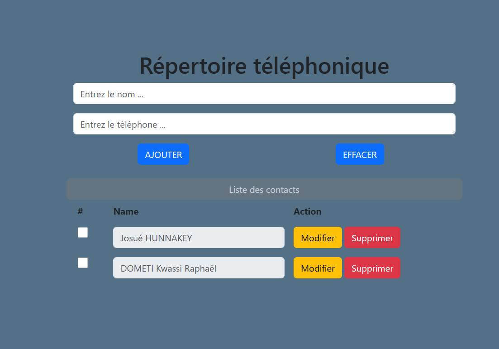
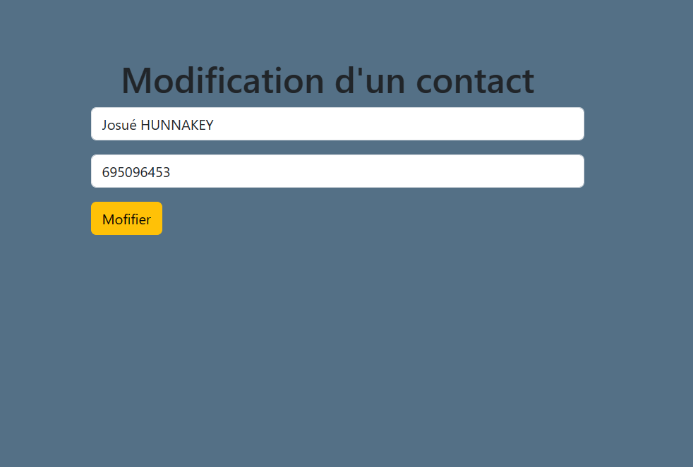
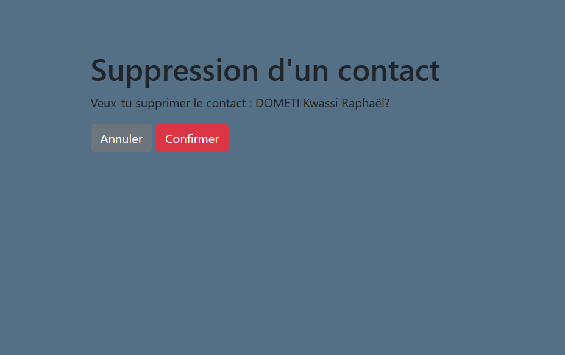
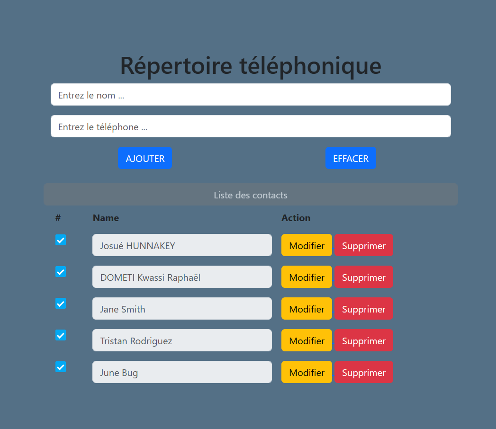

# PROJET_Django_ISEL3_Repertoire
projet2-Django_ISEL3_Repertoire created by Hunnakey K.J. and Kaleb S.

## Etat du rendu
Le lien boostrap ajouté au projet est un lien web.
Il est indispensable de possedez le minimum de connexion pour que l'affichage doit 
correct.

Notre version de app etc .

## Fonctionnalités du jeu
* Implementation 1.
* Implementation 2.
* Implementation 3.
## Régles
* regle 1
* regle 2
* regle 3
## Exécution
### Jeu
Veuillez executer les commandes suivantes
* git clone https://github.com/Ashkaji/PROJET_Django_ISEL3_Repertoire
* cd src
* python manage.py runserver (bug) #la route principale
doit etre sur le /contact#

### Test
Notre rendu contient ??  tests contenus dans le package fr/--/--/--

### Rendu des operations de Crud
* Grandes lignes
#### Ajout de contact (CREATE)
* explications puis capture d'ecran
* 

#### Modification de contact (UPDATE)
* explications puis capture d'ecran
* 

#### Suppression de contact (Delete)
* explications puis capture d'ecran
* 

#### Affichage des contact
* explication puis capture
* 
